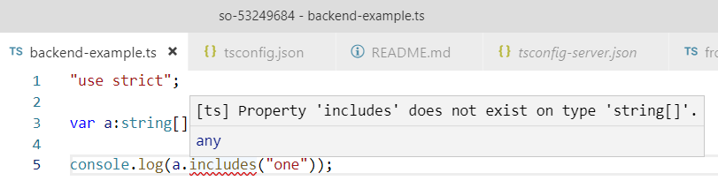

# so-53249684
stackoverflow 53249684 question example

## Problem

  1. `/src/server/backend-example.ts` must target to es2017 and check with es2017 libs
  2. `/src/client/frontend-example.ts` must target to es2015 and check with es2015 and dom libs

In Visual Studio Code

  1. in `/src/server/backend-example.ts` `includes` is marked as error. That is not what I want. 
  2. in `/src/client/frontend-example.ts` `includes` is marked as error. That is what I expect. 

## The question

> How I set Visual Studio to use `tsconfig-server.json` in `/src/server/`?

## notes

  *  https://stackoverflow.com/questions/53249684/how-to-have-different-libraries-for-differents-directories-in-vsc-for-ts
  * https://stackoverflow.com/questions/53243287/how-to-have-different-targets-for-differents-directories